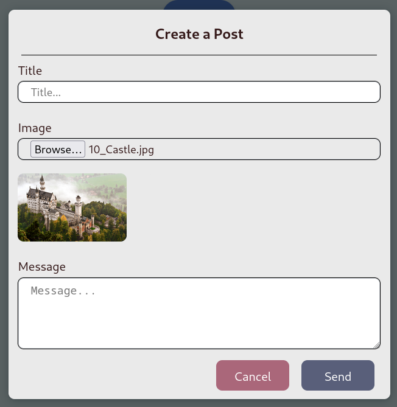

# Front End - React

## Instructions:
For front end to work properly navigate to **./src/store/redux/config/getAPI.js**. From this file, change the backend link which is denoted as **API_LINK** to the backend in production.

## show-image-preview



It allows us to show selected image preview through file type input. Search for **show-image-preview** keyword for it. It is located at **/src/components/NewPostOverlay.js** (I changed the old way of image preview code from normal to redux based checker). The authentic snippet is given down below.

```javascript
const [imageSrc, setImgSrc] = useState("");

const [imagePreviewMessage, setImagePreviewMessage] = useState(
    "Please choose an image!"
);

..................................

const imageChangeHandler = (e) => {
    const file = e.target.files[0];

    const fileExtension = file.name.split(".").pop();
    const validFileExtensions = ["jpg", "jpeg", "png", "gif"];
    const isImageFile = validFileExtensions.includes(fileExtension);

    if (isImageFile) {
      const fileUrl = URL.createObjectURL(file);
      return setImgSrc(fileUrl);
    }
    setImgSrc("");
    setImagePreviewMessage("Not an image file!");
  };

..................................

<div className={classes["image-preview"]}>
    {!imageSrc && <p>{imagePreviewMessage}</p>}
    {imageSrc && }
</div>

```

## prevent-scrolling-on-modal-open

The overflow and height property restricts a person to stop scrolling when modal window opens. This is now moved inside redux reducer sections (each window toggle reducer).

```javascript
const quitPostWindow = () => {
  dispatch(postFormValidityActions.resetFormValidity());
  setIsPostWindowOpen(false);

  // prevent-scrolling-on-modal-open
  document.body.style.overflow = "auto";
  document.body.style.height = "auto";
};

const openPostWindow = () => {
  setIsPostWindowOpen(true);

  // prevent-scrolling-on-modal-open
  document.body.style.overflow = "hidden";
  document.body.style.height = "100vh";
};
```

## close-mobile-window-if-clicked-outside-navbar

```javascript
const clickRef = useRef(null);

.................

const outsideNavbarClickHandler = useCallback((e) => {
    if (clickRef.current && !clickRef.current.contains(e.target)) {
      mobileMenuCtx.closeMenuState(); // close menu with Context api or other state management tool
    }
}, [mobileMenuCtx]);

.................

useEffect(() => {
    document.addEventListener("click", outsideNavbarClickHandler);

    return () =>
      document.removeEventListener("click", outsideNavbarClickHandler);
  }, [outsideNavbarClickHandler]);

return (
  <section ref={clickRef}>
    .................
  </section>

```

## sending-file-from-reactjs-to-nodejs-for-upload

Here, we upload file to backend. In the backend (REST API), multer package is used and it is exactly same as using NodeJS backend and EJS front end. Check that project for more info to set up the backend with multer.

For the ReactJS front end, details are written to **PostOverlay.js**, **updateOnePost.js** and **postOnePost.js**. Alternatively search the keyword inside the file.

Entire idea is to construct the form as **new FormData()**.

```javascript
// sending-file-to-backend
// this is a built-in Javascript object
// which is often used to send data to a server via XMLHttpRequest or the Fetch API,
// especially when dealing with file uploads.
const postData = new FormData();

// sending-file-to-backend
postData.append("title", enteredTitle);
// Keep in mind that actual image object is used here.
postData.append("image", actualImageObj);
postData.append("details", enteredDetails);

// sending-file-to-backend
dispatch(createNewPost(postData));
```

```javascript
try {
  const res = await fetch(getAPI.postOnePost, {
    method: "POST",
    // sending-file-from-reactjs-to-nodejs-for-upload
    body: postDetails,

    // Normally like this but here, we upload file to backend.
    // we use a different scenario
    // body: JSON.stringify(postDetails),
    // headers: {
    //   'Content-Type': 'application/json',
    // },
  });

  if (!res.ok) {
    throw new Error(`HTTP error! Status Code: ${res.status}`);
  }

  const data = await res.json();
  dispatch(successHandler(data));
  dispatch(loadingHandler(false));
  return data;
} catch (err) {
  dispatch(failHandler(err.message));
  dispatch(loadingHandler(false));
}
```

## get-link-params-and-queries
In NodeJS, req.params and req.query are used for link parameters and queries. In React, we use useParams and useSearchParams for this type of requests.

For **localhost:3000/:id** or **localhost:3000/65b3987308526049af2c1b9d** link where you need to get the **id** parameter
```javascript
import { useParams } from "react-router-dom";
const params = useParams();

console.log(params.id);
```

For **localhost:3000/?p=2** link where you need to get the **p** parameter
```javascript
import { useSearchParams } from "react-router-dom";

const [searchParams] = useSearchParams();
console.log(searchParams.get("p"));
```