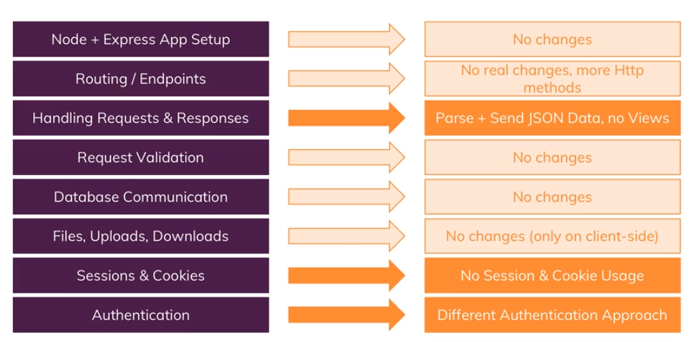

# REST API Notes:

- Here are some differences in between a coupled front and backend vs REST API.

  

- There are 5 different requests in REST API. These are GET, POST, PUT, PATCH and DELETE requests.

  **GET**: Get a resource from the server. <br/>
  **POST**: Create or append a resource in the server. <br/>
  **PUT**: Create or overwrite a resource in the server. <br/>
  **PATCH**: Update parts of an existing resource in the server. <br/>
  **DELETE**: Delete a resource from the server.

- This part is not needed in index.js when you are working with REST API.

  ```javascript
  // REST API deals with JSON data, don't use it.
  // app.use(express.urlencoded({ limit: "50mb", extended: true }));
  app.use(express.json({ limit: "50mb" }));
  ```

- This section prevents CORS error from another website. Here is a CORS middleware.

  ```javascript
  // CORS Error Prevention
  app.use((req, res, next) => {
    // Allow to communicate from any origin
    res.setHeader("Access-Control-Allow-Origin", "*");
    // Allow to send any request
    res.setHeader(
      "Access-Control-Allow-Methods",
      "GET, POST, PUT, PATCH, DELETE"
    );
    // Allow to set a content type with fetch request
    res.setHeader(
      "Access-Control-Allow-Headers",
      "Content-Type, Authorization"
    );

    next();
  });
  ```
